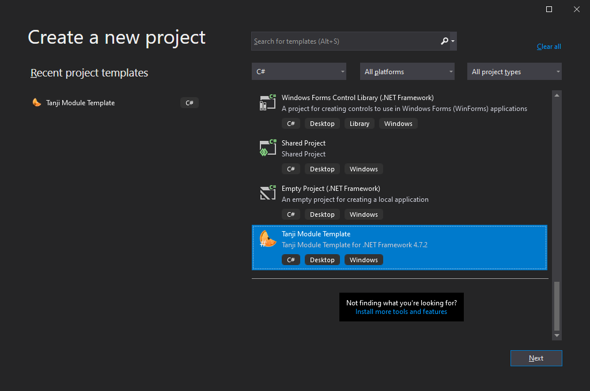
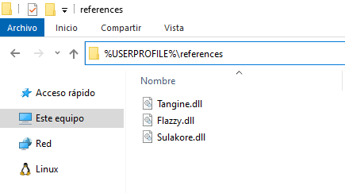

# Tanji Module Template

Basic Tanji module base:
- Visual C# Windows Forms App
- targeting .NET Framework 4.8
- added `using` directives
- added mandatory `[Module()]` line
- renamed inheritance from `Form` to `ExtensionForm`
- set IsRemoteModule => true to debug externally

# Acknowledgements
Based on Darkbox Urban resource ["Tanji/For developers/Plugin development/Setting up"](https://urban.darkbox.nl/tanji/develop/7) (revision: last edited: 23-05-2018 19:16:31) by [Squiz](https://urban.darkbox.nl/account/Squiz) which details the manual steps.

# Add the template
Place the released ZIP in the default Project template directory `%USERPROFILE%\Documents\Visual Studio 2019\Templates\ProjectTemplates\`

If you have set a custom directory, you can see it at `Visual Studio menu bar "Tools"/Options…/Projects and Solutions/Locations/User project templates location`

# Delete the template
The reverse way of how to add it: simply delete the ZIP.

# Use the template
- Create a new project in Visual Studio
- Choose the "Visual C#" category in which the template should appear as last in the list
- Add the dependencys Sulakore and Tangine!

If you open Form1.cs before adding the dependencys it will fuck you up. If so, add the dependencys *then* and *close and reopen* the solution (if you only open it while a file in it is the active tab, it won't reload).

- Change the Assembly name of the project at `Visual Studio menu bar "Project"/Properties…/Application/Assembly name`

You may also want to update the Copyright year at `Assembly Information…`

# __TIP__: Use the template in just two steps
1. Verify that your dependencies are located at `%USERPROFILE%\references`

2. Create a new project in `C:\Users\%USERNAME%\Desktop`

# Make a template yourself
- Visual Studio menu bar "Project"/Export Template…
- Keep Template Type = Project template
- Append version number to the template name (e.g. `v1.0`)
- Set description `Basic Tanji module base`
- Use the [Tanji icon](https://github.com/ArachisH/Tanji/blob/master/Tanji/Resources/Tanji_256.ico) as Icon Image

E.g. if Tanji modules target a new .NET Framework version and you want to contribute by pushing an updated version.
